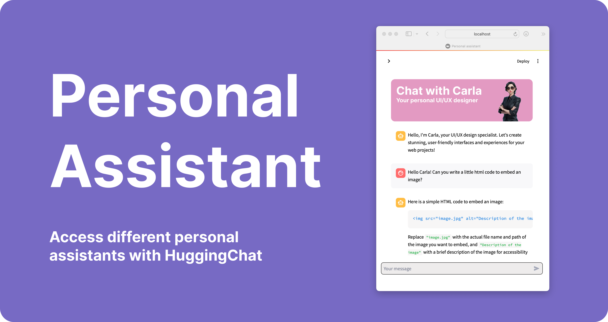

<div align="center">
  
</div>

<h3 align="center">
  <b><a href="https://azerty-labs.com">Online App</a></b>
  •
  <b><a href="#usage">Usage</a></b>
  •
  <b><a href="">Demo Screenshot</a></b>
</h3>

<div align="center">
  <a href="https://opensource.org/licenses/MIT">
    
  </a>
  
</div>
</br>

<p align="center">
  <b>Personal Assistant</b> is a <a href="https://streamlit.io/">Streamlit</a> application that allows users to interact with HugChat, providing an intuitive interface for engaging with AI-driven chatbot models. It supports custom assistants tailored to specific user needs and features secure user authentication.
</p>

## Features

- **User Authentication**: Securely login using your email and password, with cookies stored locally for a seamless experience.
- **Three Customizable Assistants**:
  - **David - Sports Coach**: A personal sports coach dedicated to helping you achieve your fitness and athletic goals through tailored advice and encouragement.
  - **Synthia - Eurorack Expert**: A Eurorack synthesizer specialist who guides you in exploring and mastering your modular synthesizer setups.
  - **Carla - UI/UX Designer**: A UI/UX designer with expertise in HTML, React, and CSS, ready to help you improve web interfaces and user experiences through effective design and coding practices.
- **Web Search Integration**: Enable or disable web search functionality to enhance the chatbot's responses.
- **Session Management**: Maintains chat history within the session, allowing for a continuous conversation experience.
- **Streamlined Interface**: A user-friendly chat interface that supports real-time interaction with the AI assistant.

## Usage

To use the app, simply go to the online demo hosted by streamlit. Log in with your hugging face credentials and start interacting with the AI assistant.

### Selecting an Assistant

- Navigate to the sidebar and choose from one of the three available assistants:
  - **David - Sports Coach**: Get personalized fitness advice and motivation.
  - **Synthia - Eurorack Expert**: Explore and master your Eurorack synthesizer setup.
  - **Carla - UI/UX Designer**: Improve your web design projects with expert UI/UX guidance.
  
- Enable the "Allow web search" option if you want the assistant to fetch real-time information from the web.
- Click on "Initialize assistant" to start the chat.

### Chatting with the Assistant

- Type your queries in the chat input box.
- The assistant will respond based on your selected preprompt settings and available options.
- Your chat history is preserved throughout the session for easy reference.

## Run app locally

If you want to run the Personal Assistant Streamlit app locally, multiple solutions are possible:

1. **Run the app directly in a virtual environment**
    
    Clone the repository:
    ```
    git clone https://github.com/chloelavrat/Personal_Assistant.git
    cd Personal_Assistant
    ```
    Create, activate, and install your environment:
    ```
    python -m venv .venv
    source .venv/bin/activate
    pip install -r requirements.txt
    ```
    Run the app using Streamlit:
    ```
    streamlit run streamlit_app.py
    ```

2. **Run the app using Docker**

    Build the `personal-assistant` Docker container:
    ```
    docker build -t personal-assistant .
    ````
    Run the container at a specified port (e.g., 8501):
    ```
    docker run -p 8501:8501 personal-assistant
    ```
    Go to your web browser and access [localhost:8501](http://localhost:8501).

## Contributing

Contributions to the project are welcome! If you encounter any issues or bugs, please open an issue on the GitHub repository. To contribute code, fork the repository, make your changes, and submit a pull request.

## License

This project is licensed under the MIT License. See the [LICENSE](LICENSE) file for details.
